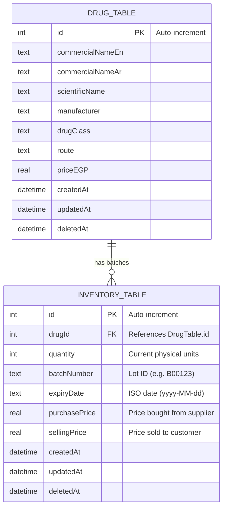

# ProtoPharma Data Flow & Table Architecture

This document explains the local database architecture in the ProtoPharma application, specifically how **drugs** and **inventory batches** are structured, related, and queried.

---

## 1. Database Schema Design (One-to-Many)

ProtoPharma uses a local SQLite database powered by **Drift** (`AppDatabase`). To mirror real-world pharmacy logistics, the database decouples the **medication catalog** from the **physical stock**.



### Table 1: DrugTable (`drug_table`)
* **Purpose**: Serves as the static master catalog of drugs (metadata, manufacturer, scientific name, etc.).
* **Key characteristic**: There is exactly **one row** per distinct drug product.
* **Fields**:
  * `id`: Auto-incrementing identifier.
  * `commercialNameEn` / `commercialNameAR`: Bilingual names.
  * `priceEGP`: Recommended selling price.
  * `drugClass`: Therapeutic category (e.g., "Analgesic", "Antidiabetic") used for filtering.

### Table 2: InventoryTable (`inventory_table`)
* **Purpose**: Tracks actual physical items sitting on pharmacy shelves.
* **Key characteristic**: There can be **multiple rows** (batches/lots) for a single drug. Real pharmacies receive shipments at different times with different costs and different expiration dates.
* **Fields**:
  * `drugId`: Foreign key pointing to `drug_table.id`.
  * `quantity`: The count of physical units available in this particular batch.
  * `batchNumber`: Unique barcode/lot identifier.
  * `expiryDate`: ISO-8601 string (`yyyy-MM-dd`) storing when the lot expires.
  * `purchasePrice` / `sellingPrice`: Financial fields (to track profit margins).

---

## 2. Dynamic Calculations & Status Flags

Decoupling catalog info from quantity info means we do not write stock values directly onto the drug row. Instead, they are calculated dynamically:

* **Total Stock**: Calculated as the sum of `quantity` across all inventory batches for that drug:
  $$\text{Total Stock} = \sum \text{quantity}_{\text{batch}}$$
* **Nearest Expiry**: The earliest expiry date across all active batches for that drug:
  $$\text{Nearest Expiry} = \min(\text{expiryDate}_{\text{batch}})$$

In the Flutter application, these values are wrapped inside the `DrugModel` class. Based on the calculated `totalStock`, a drug falls into one of three statuses:
* **Out of stock**: Total stock $\le 0$.
* **Low stock**: $0 < \text{Total Stock} \le 10$ (defined by `DrugModel.lowStockThreshold`).
* **In stock**: Total stock $> 10$.

---

## 3. Data Flows in Action

### A. Initialization & Seeding (On Startup)
When the app starts, `main.dart` defers database seeding by 500ms to keep launch rendering fast:
1. `insertAllDrugs(db)` chunks and inserts catalog data into `drug_table`.
2. `seedInventory(db)` checks if `inventory_table` has data. If empty, it maps over the inserted drugs and inserts mock batches:
   * 10% are seeded as Out of Stock (`quantity = 0`).
   * 20% are seeded as Low Stock (`quantity = 1..9`).
   * 70% are seeded as In Stock (`quantity = 15..199`).
   * Specific batches are marked as expiring soon (within 5–19 days) to feed testing alerts.

### B. Catalog Listing & Search (Inventory Screen)
When the user visits the Inventory screen:
1. `InventoryCubit` requests page data using `DrugsRepository.searchLocalDrugs()`.
2. The repository queries `drug_table` applying active filters (such as `query` search matching English or Arabic names, `category` category filters, and `inStockOnly` toggles).
3. The repository grabs the matching list of raw drug records.
4. **The Join/Enrichment Step (`_attachStock`)**:
   * It takes the list of drug IDs and runs a single optimized SQLite rollup query on `inventory_table`:
     ```sql
     SELECT drug_id, SUM(quantity) AS total_stock, MIN(expiry_date) AS min_expiry
     FROM inventory_table
     WHERE drug_id IN (?, ?, ?, ...)
     GROUP BY drug_id
     ```
   * It maps these totals back into the list of `DrugModel` instances via `copyWith(totalStock, nearestExpiry)`.
5. The `InventorySuccess` state is emitted, and `DisplayTable` builds stock badges displaying status colors (red/amber/green) and quantities.

### C. Live Dashboard Alerts & Counts
The dashboard needs live counts of alerts (Out of stock, Low stock, Expiring batches) without slowing down the UI:
1. **Watch Counts Stream**:
   * `DrugsRepository.watchAlertCounts()` returns a stream of `AlertCounts`.
   * Under the hood, it queries SQLite using standard SQL aggregates over a subquery:
     ```sql
     SELECT 
       SUM(CASE WHEN total_stock <= 0 THEN 1 ELSE 0 END) AS out_of_stock,
       SUM(CASE WHEN total_stock > 0 AND total_stock <= ?1 THEN 1 ELSE 0 END) AS low_stock,
       SUM(CASE WHEN total_stock > ?1 AND min_expiry <= ?2 THEN 1 ELSE 0 END) AS expiring
     FROM (
       SELECT drug_id, SUM(quantity) AS total_stock, MIN(expiry_date) AS min_expiry
       FROM inventory_table GROUP BY drug_id
     )
     ```
   * Drift automatically triggers this stream whenever `inventory_table` records are inserted, updated, or deleted.
2. **Paged Alerts Fetch**:
   * When clicking on a tab (e.g. "Low Stock"), the UI calls `DrugsRepository.fetchAlerts(type, limit, offset)`.
   * It runs a similar custom SQL join query that filters the rollup by the specific alert threshold and returns a paginated list of `InventoryAlert` records.

---

## 4. Key Advantages of This Decoupling

1. **Parity with Backend**: The backend database schema uses this exact 2-table model. Decoupling them locally means local-to-remote synchronization is straightforward.
2. **Expiry Management**: Storing stock in batches lets the app warn pharmacists about expiring medication batches. A single `quantity` field on the drug row could never track individual expiration dates.
3. **Database Performance**: By aggregating quantities and minimum dates in SQLite (via `SUM`, `MIN`, `GROUP BY`), the app loads only a handful of rows to display pages and metrics, saving mobile CPU/RAM.
