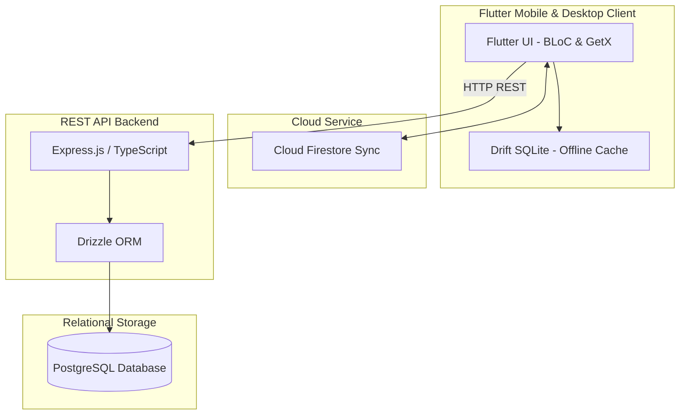

<div align="center">

# 💊 Protopharma

<!-- Banner image referencing our copy in the repository -->


<h3>A Premium Full-Stack Pharmacy & Medication Management Suite</h3>

[](https://flutter.dev)
[](https://expressjs.com)
[](https://www.typescriptlang.org)
[](https://www.postgresql.org)
[](https://www.docker.com)

</div>

---

## 📖 Introduction

**Protopharma** is an enterprise-grade, premium full-stack solution designed for retail pharmacies, clinical medication tracking, and inventory management. 

Combining a highly-responsive, offline-first cross-platform client with a secure, containerized Node.js REST API, it provides a seamless user experience tailored for high-frequency cashiers and pharmacists.

---

## ⚡ System Architecture

Protopharma is built with clean architecture in mind, using a local SQLite cache for ultra-fast load times, combined with secure, encrypted REST calls for transactions and Firestore integration for cloud-based inventory synchronization.



---

## ✨ Features

### 📱 Frontend Client
* **Offline-First Capabilities:** Utilizes **Drift (SQLite)** to cache the entire medication registry locally, enabling search, filtering, and navigation without network delays.
* **Dual Theme Support:** Sleek UI matching device preferences (Light / Dark mode) built with a custom-crafted color palette and typography (Cairo & Outfit).
* **Robust State Management:** Implements **flutter_bloc** for transaction states, search queries, and inventory tracking.
* **Firebase Integration:** Real-time synchronization of cloud medication catalogs.

### 🖥️ Backend REST API
* **Type-Safe ORM Schema:** Database queries are validated compile-time using **Drizzle ORM**.
* **Secure Authentication:** Cashier and pharmacist PINs are hashed using Node's native **scrypt** salt-hashing.
* **Role-Based Permissions:** Built-in categorization supporting `admin`, `pharmacist`, and `cashier` user types.
* **Dockerized Infrastructure:** Ready-to-go database and server environments using Docker Compose.

---

## 🚀 Getting Started

<details>
<summary><b>🛠️ Prerequisites</b></summary>

Before starting, ensure you have the following installed:
* [Flutter SDK](https://docs.flutter.dev/get-started/install) (latest stable version)
* [Node.js](https://nodejs.org/) (v18+)
* [Docker Desktop](https://www.docker.com/products/docker-desktop/) (optional, for running backend services)
* A running PostgreSQL database (if running backend bare-metal)

</details>

<details>
<summary><b>🖥️ Backend Server Setup</b></summary>

The backend resides in the `/backend` folder.

#### Running with Docker Compose (Recommended)
This automatically provisions both a PostgreSQL instance and the Node.js API server:
```bash
cd backend
docker compose up --build
```
The API will be exposed on `http://localhost:8000`.

#### Running Bare-Metal
1. Navigate to the folder:
   ```bash
   cd backend
   ```
2. Install Node modules:
   ```bash
   npm install
   ```
3. Update connection credentials in [index.ts](file:///d:/Developing/Flutter%20projects/protopharma/full-stack/protopharma/backend/src/db/index.ts):
   ```typescript
   const pool = new Pool({
       connectionString: "postgresql://<user>:<password>@<host>:<port>/<dbname>"
   });
   ```
4. Boot up development server:
   ```bash
   npm run dev
   ```

</details>

<details>
<summary><b>📱 Frontend Client Setup</b></summary>

The mobile app resides in the `/frontend` folder.

1. Navigate to the folder:
   ```bash
   cd frontend
   ```
2. Fetch Dart dependencies:
   ```bash
   flutter pub get
   ```
3. Boot up the app on your emulator or connected device:
   ```bash
   flutter run
   ```

</details>

---

## 🔒 API Specifications

<details>
<summary><b>📝 Authentication Routes</b></summary>

#### `POST /auth/signup`
Creates a new pharmacist or cashier user. 

* **Headers:** `Content-Type: application/json`
* **Request Body:**
  ```json
  {
    "username": "sarah_p",
    "fullName": "Sarah Pharmacist",
    "pin": "2580",
    "role": "pharmacist"
  }
  ```
  > [!IMPORTANT]
  > The `pin` must be exactly a 4-digit numeric string. Invalid formats will result in a `400 Bad Request` status.

* **Response (201 Created):**
  ```json
  {
    "message": "User registered successfully",
    "user": {
      "id": 1,
      "username": "sarah_p",
      "fullName": "Sarah Pharmacist",
      "role": "pharmacist"
    }
  }
  ```

#### `GET /auth`
Authentication index tester route. Returns message `"hey from auth"`.

</details>

---

## 🧪 Quality Assurance & Tests

All components are strictly typed and audited through automatic build checks:
* **TypeScript compilation checks:**
  ```bash
  cd backend
  npx tsc --noEmit
  ```
* **Flutter formatting and static code checks:**
  ```bash
  cd frontend
  flutter analyze
  ```
* **Flutter unit and widget tests:**
  ```bash
  cd frontend
  flutter test
  ```
